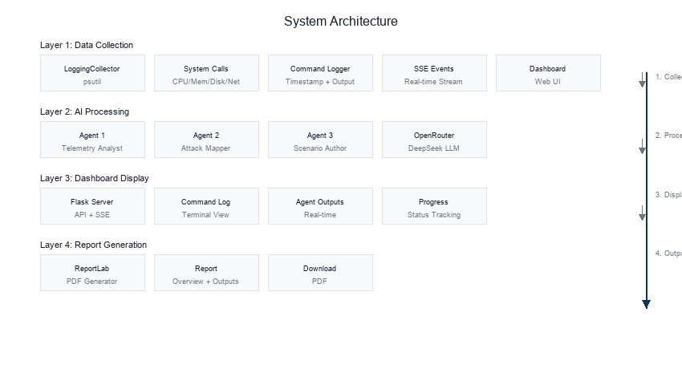

# Scry

**Reveal Hidden Threats** - A transparent AI-powered security analysis platform that combines live Windows telemetry with multi-agent DeepSeek AI analysis.

Scry (skree) - from the old English word meaning "to look into the future, to discover hidden knowledge" - exactly what this app does by revealing unseen security threats in your system.

---

## Key Features

**100% Real Data** - Every metric comes directly from your Windows system via native APIs including CPU, memory, disk, network, and processes.

**Transparent AI** - Watch the AI think in real-time. See exact prompts, raw command outputs, and DeepSeek reasoning as it happens.

**Multi-Agent Pipeline** - Three specialized DeepSeek agents: Observation Agent, Threat Agent, and Scenario Agent.

**MITRE ATT&CK Mapping** - Automatically maps detected patterns to industry-standard MITRE ATT&CK tactics and techniques.

**Live Dashboard** - Modern web interface with real-time command logging, AI output streaming, and PDF report generation.

---

## System Architecture

<figure>
<p align="center">
  
</p>
<figcaption align="center"><b>Figure 1:</b> System Architecture</figcaption>
</figure>

The system consists of four layers that work sequentially to collect, process, analyze, and report on system telemetry.

**Layer 1: Data Collection**

The LoggingCollector module uses psutil to execute system calls for cpu_percent, process_iter, net_connections, disk_usage, and virtual_memory. Each command is logged with its timestamp, raw output, execution duration, and success status. Events stream to the dashboard via Server-Sent Events.

**Layer 2: AI Processing**

The Agent Chain sends telemetry to three DeepSeek LLM instances via OpenRouter. Agent 1 (Observations) extracts factual observations from raw data. Agent 2 (Threats) maps attack surface from Agent 1 output plus original telemetry. Agent 3 (Scenarios) generates defensive scenarios from both prior outputs with MITRE ATT&CK mapping. All responses stream token-by-token to the dashboard.

**Layer 3: Dashboard Display**

Flask hosts the web interface and API endpoints. The Command Log tab displays system commands and raw outputs in terminal format. The Visualizations tab shows charts and data tables. The Agent Outputs tab shows full DeepSeek AI analysis.

**Layer 4: Report Generation**

ReportLab generates professional PDF reports containing system overview, telemetry summary, threat analysis, MITRE ATT&CK scenarios, and all agent outputs. Reports download after analysis completes.

---

## Tech Stack

| Component | Technology | Purpose |
|-----------|------------|---------|
| Backend | Python 3.10+ | Core logic and processing |
| Web Server | Flask | HTTP API and SSE streaming |
| Telemetry | psutil | System metrics collection |
| AI Provider | OpenRouter + DeepSeek | Language model analysis |
| Frontend | Vanilla JS | Dashboard interface |
| Styling | CSS (Apple Design) | Modern UI |
| PDF | ReportLab | Report generation |

---

## Setup Instructions

### Prerequisites
- Windows 10/11
- Python 3.10 or higher
- Internet connection (for AI analysis)

### Step 1: Clone the Repository
```bash
git clone https://github.com/ritvikindupuri/Cipher-security.git
cd Cipher-security
```

### Step 2: Create Virtual Environment
```bash
python -m venv .venv
.\.venv\Scripts\Activate.ps1
```

### Step 3: Install Dependencies
```bash
pip install -r requirements.txt
```

### Step 4: Get Your OpenRouter API Key

OpenRouter provides access to DeepSeek and other AI models through a unified API. Here's how to get started:

**4.1 Create an OpenRouter Account**
1. Go to https://openrouter.ai
2. Click "Sign Up" and create an account (you can use Google, GitHub, or email)
3. Verify your email if required

**4.2 Get Your API Key**
1. After logging in, click on your profile icon in the top-right corner
2. Select "Keys" from the dropdown menu
3. Click "Create Key"
4. Give it a name (e.g., "Scry App")
5. Copy the generated API key - it starts with `sk-or-v1-`

**4.3 Add Credits (Required for API Usage)**
1. Click on your profile and select "Credits"
2. Click "Add credits" 
3. Add funds (DeepSeek is one of the cheapest models - $0.50-$1.00 typically covers hundreds of analyses)
4. DeepSeek DeepSeek Chat v3 costs approximately $0.001 per 1K tokens - very affordable!

**4.4 Choose Your Model**

The `.env` file comes pre-configured with `deepseek/deepseek-chat-v3`, which is:
- Fast response times
- Excellent for analysis tasks
- Very cost-effective
- Available on OpenRouter's free tier for new users

Other recommended models on OpenRouter:
| Model | Cost | Best For |
|-------|------|----------|
| `deepseek/deepseek-chat-v3` | ~$0.50/1M tokens | **Recommended** - Balanced speed/quality |
| `deepseek/deepseek-r1` | ~$0.50/1M tokens | Better reasoning, slower |
| `anthropic/claude-3.5-haiku` | ~$0.80/1M tokens | Fast, good quality |
| `google/gemini-2.0-flash-exp` | Free | No cost, good quality |

### Step 5: Configure Environment

Create a `.env` file in the project root with your OpenRouter configuration:

```bash
# Enable OpenRouter (required)
USE_OPENROUTER=1

# Your OpenRouter API key (paste your key here)
OPENROUTER_API_KEY=sk-or-v1-your-key-here

# Model selection (deepseek/deepseek-chat-v3 is recommended)
OPENROUTER_MODEL=deepseek/deepseek-chat-v3
```

Example with a real key:
```bash
USE_OPENROUTER=1
OPENROUTER_API_KEY=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
OPENROUTER_MODEL=deepseek/deepseek-chat-v3
```

**How the App Uses These Variables:**
- `USE_OPENROUTER=1` tells the app to use OpenRouter instead of Anthropic directly
- `OPENROUTER_API_KEY` authenticates your requests to OpenRouter's API
- `OPENROUTER_MODEL` specifies which AI model to use for all three agents

### Step 6: Run the Dashboard
```bash
python app.py
```

### Step 7: Open in Browser
Navigate to http://127.0.0.1:5000

### Step 8: Execute Analysis
1. Click **"Execute Analysis"**
2. Watch telemetry collection in the **Command Log** tab
3. Switch to **Visualizations** to see live charts
4. Switch to **Agent Outputs** to see full DeepSeek analysis
5. Download PDF report when complete

---

## Understanding the Analysis

### What Each Agent Does

**Observation Agent** analyzes raw system telemetry:
- CPU, memory, disk usage metrics
- Running processes and their resource usage
- Network connections and listening ports
- Potential anomalies in system state

**Threat Agent** maps the attack surface:
- Identifies processes with network access
- Flags unusual network connections
- Maps observations to potential attack vectors
- Uses MITRE ATT&CK framework for classification

**Scenario Agent** generates defensive scenarios:
- Creates hypothetical attack chains based on observations
- Maps each phase to MITRE tactics and techniques
- Provides detection signals for each phase
- Suggests investigation and mitigation steps

### MITRE ATT&CK Framework

The app maps security observations to MITRE ATT&CK tactics:
| Tactic | Description |
|--------|-------------|
| TA0001 - Initial Access | How an attacker might gain entry |
| TA0002 - Execution | How malicious code might run |
| TA0003 - Persistence | How an attacker might maintain access |
| TA0004 - Privilege Escalation | How an attacker might gain elevated access |
| TA0005 - Defense Evasion | How an attacker might avoid detection |
| TA0011 - Command & Control | How an attacker might communicate with systems |
| TA0010 - Exfiltration | How an attacker might steal data |

---

## Troubleshooting

**Agent gets stuck on "Running..."**
- Check your OpenRouter API key is valid
- Ensure you have credits in OpenRouter
- DeepSeek models may be rate-limited during high traffic

**No data in visualizations**
- Make sure you're running on Windows
- Check telemetry collection completed successfully in Command Log

**API Errors**
- Verify your `OPENROUTER_API_KEY` is correct
- Check you have sufficient credits at openrouter.ai/credits
- Try a different model if DeepSeek is unavailable

---

## License

MIT License
